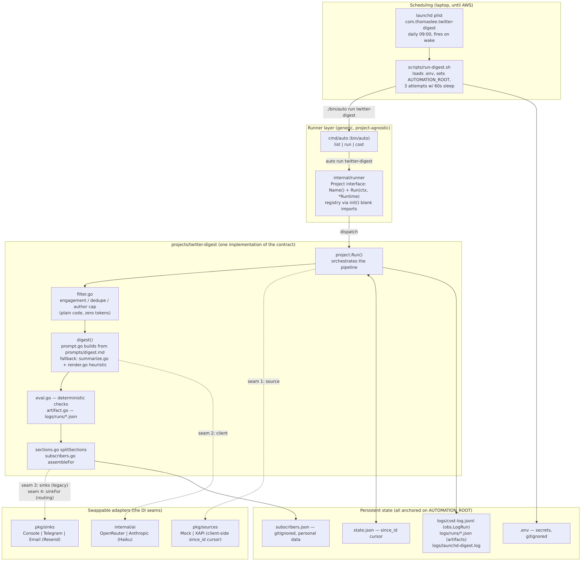
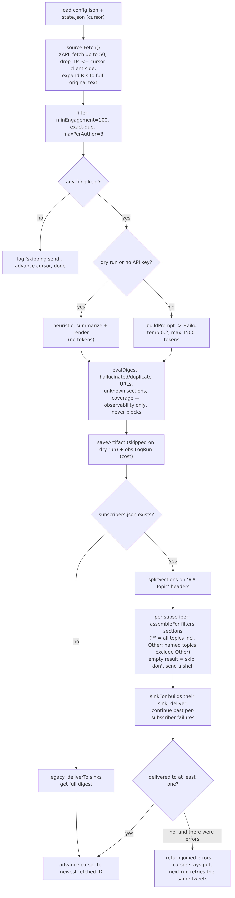

# Personal Automation Foundation

A small, reusable "automation OS" written in Go: one runner binary, pluggable automation projects
behind a single interface, and shared adapters for data sources, LLM providers, and delivery channels.
Built as a learning project with production habits - tests, cost logging, run artifacts, and deterministic evals

**Project #1 — `twitter-digest`:** a daily 9am Twitter/X list briefing. Posts are fetched, filtered in plain code before model sees them.
summarized into topic sections by Claude Haiku, checked by a deterministic eval, and routed to subscribers - each with their own delivery channel
(Telegram / email), topic selection, and output language.

## Architecture

One digest run, end to end:


The runner knows nothing about any project except the contract:

```go
type Project interface {
    Name() string
    Run(ctx context.Context, rt *Runtime) error
}
```

Projects register themselves via `init()`; adapters (sources, LLM clients, sinks) hang off small interfaces so every pipeline stage can be swapped - or faked in tests


## Layout
```
.
├── cmd/auto/            # runner CLI: auto list | run <project> [--dry-run] | cost
├── internal/
│   ├── runner/          # Project contract + registry
│   ├── ai/              # LLM clients (Anthropic, OpenRouter)
│   ├── obs/             # cost log + report
│   └── config/          # per-project config.json loading
├── pkg/
│   ├── sources/         # data sources: X API v2 (paginated), mock
│   └── sinks/           # delivery: telegram (HTML), email (Resend), console
├── projects/
│   ├── hello/           # smallest possible project (template)
│   └── twitter-digest/  # project #1: filter, prompt, eval, routing, state
├── scripts/             # run-digest.sh (launchd entry point, .env loader, retries)
├── docs/                # decisions, diagrams, setup notes
└── logs/                # cost log + per-run artifacts (gitignored)
```

## Quick start
```bash
go build -o bin/auto ./cmd/auto
./bin/auto list
./bin/auto run twitter-digest --dry-run   # no delivery, no cursor writes
./bin/auto cost                           # spend report from logs/cost-log.jsonl
```

offline demo without any credentials: set `"source": "mock"` in `projects/twitter-digest/config.json` and dry-run -canned tweets 
go trhough the full filter + heuristic-summary path with zero network calls.

## Subscribers

`projects/twitter-digest/subscribers.json` (gitignored - personal data; see `subscribers.example.json`)
maps each recipient to a sink, topics, and language:

```json
[
  {"name": "me", "sink": "telegram", "chatId": "...", "topics": ["*"]},
  {"name": "friend", "sink": "email", "email": "...", "topics": ["AI", "Tech"], "language": "Korean"}
]
```

One LLM call per distint language, not per subscriber. Topic headers stay in English in every language
- they are routhing keys. Per-subscriber failures never block other deliveries;
the fetch cursor only advances when at least someone gets a digest

## Design principles
- **Filter before the model.** Engagement + dedup + author caps run in plain Go, the LLM only sees posts worth paying
- **Interfaces at eery seam.** Source, LLM client, and sinks are injected on the project struct; the whole test suite runs without touching the network.
- **Trust but verify.** Every run writes an artifact (Exact model input and output) and a deterministic eval checks for hallucinated URLs, duplicate stories, and unknown sections - observability only, never blocking delivery.
- **Cost is a feature.** Every model call lands in an append-only cost log; `auto cost` reports totals per project.
- **State is explicit.** A since-ID cursor in `state.json` makes runs idempotent; all persistent paths anchor on `AUTOMATION_ROOT` so test can't pollute real state.

## Roadmap
- Storage interface over state/artifact/subscribers (filesystem now; S3/DynamoDB next)
- AWS Lambda + EventBridge deployment via CDK - laptop-free scheduling
- LLM-judge eval tier over accumulated run artifacts
- More projects on the same runner

See `docs/decisions/` for the reasoning behind these choices.
