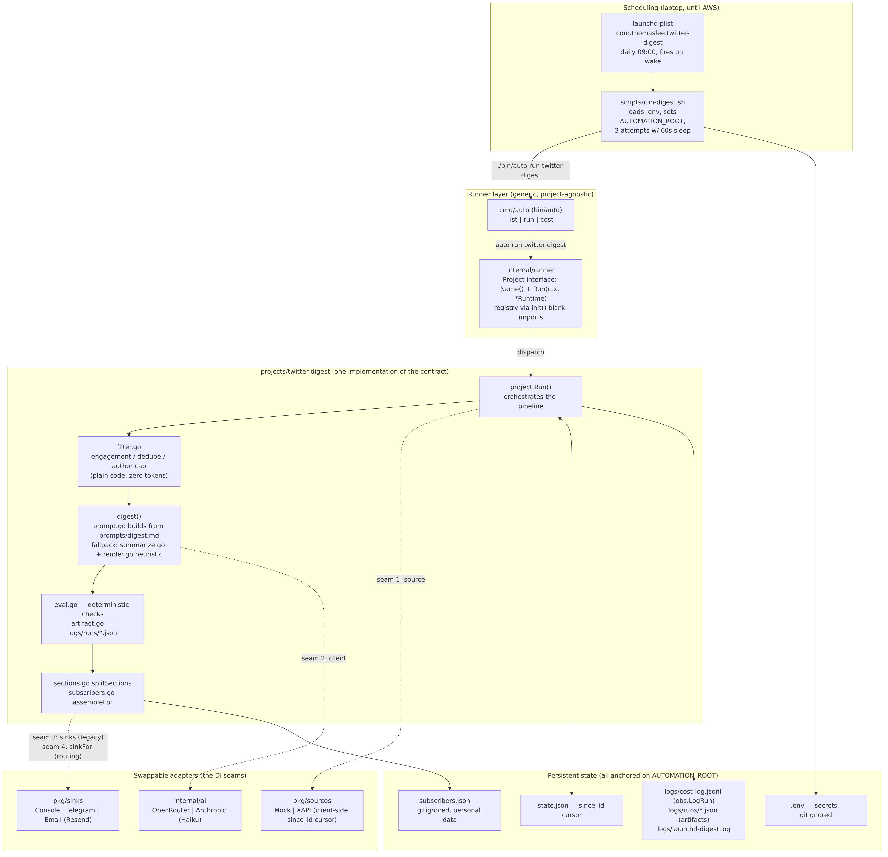
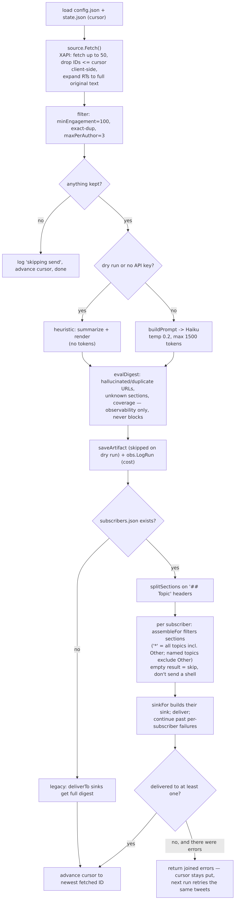

# Personal Automation Foundation

A small, reusable "automation OS" written in Go: one runner binary, pluggable automation projects
behind a single interface, and shared adapters for data sources, LLM providers, and delivery channels.
Built as a learning project with production habits - tests, cost logging, run artifacts, and deterministic evals.

**Project #1 — `twitter-digest`:** a daily 9am PT Twitter/X list briefing. Posts are fetched, filtered in plain code before the model sees them, summarized into topic sections by Claude Haiku, checked by a deterministic eval plus an LLM judge, and routed to subscribers — each with their own delivery channel (Telegram / email), topic selection, and output language.

**Project #2 — `weekly-deepdive`:** a Sunday 10am PT multi-agent brief. Reads the week's digest archive over MCP, a planner picks the biggest story, researchers corroborate with web search + fetch, a synthesizer writes a long-form brief, and an editor gate checks contract compliance (hedges on uncorroborated claims) before delivery.

## Architecture

One digest run, end to end:


The runner knows nothing about any project except the contract:

```go
type Project interface {
    Name() string
    Run(ctx context.Context, rt *Runtime) error
}
```

Projects register themselves via `init()`; adapters (sources, LLM clients, sinks) hang off small interfaces so every pipeline stage can be swapped - or faked in tests.

## Layout
```
.
├── cmd/auto/              # runner CLI: auto list | run <project> [--dry-run] | cost
├── cmd/auto-lambda/       # Lambda entry (EventBridge schedules both projects)
├── internal/
│   ├── runner/            # Project contract + registry
│   ├── ai/                # LLM clients (Anthropic, OpenRouter); Chat + Complete
│   ├── agent/             # model-with-tools loop (deepdive roles)
│   ├── obs/               # cost log + report
│   ├── storage/           # Store seam (filesystem / DynamoDB)
│   └── queue/             # durable delivery jobs (digest)
├── pkg/
│   ├── sources/           # data sources: X API v2 (paginated), mock
│   └── sinks/             # delivery: telegram (HTML), email (Resend), console
├── projects/
│   ├── hello/             # smallest possible project (template)
│   ├── twitter-digest/    # project #1: filter, digest, judge, revise, routing
│   └── weekly-deepdive/   # project #2: planner → researchers → synthesizer → editor
├── infra/                 # CDK: Lambdas + EventBridge (America/Los_Angeles)
├── docs/                  # decisions, diagrams, setup notes
└── logs/                  # local cost log + artifacts (gitignored; prod is Dynamo)
```

## Quick start
```bash
go build -o bin/auto ./cmd/auto
./bin/auto list
./bin/auto run twitter-digest --dry-run    # no delivery, no cursor writes
./bin/auto run weekly-deepdive --dry-run   # no delivery
./bin/auto cost                            # spend report
```

Offline digest demo without credentials: set `"source": "mock"` in `projects/twitter-digest/config.json` and dry-run — canned tweets go through the full filter path. Never run the mock source without `--dry-run` (it overwrites the real fetch cursor).

Scheduled runs are AWS Lambda on EventBridge (not launchd). Pushing to `main` does not deploy — see `AGENTS.md`.

## Subscribers

`projects/twitter-digest/subscribers.json` (gitignored - personal data; see `subscribers.example.json`)
maps each recipient to a sink, topics, and language:

```json
[
  {"name": "me", "sink": "telegram", "chatId": "...", "topics": ["*"]},
  {"name": "friend", "sink": "email", "email": "...", "topics": ["AI", "Tech"], "language": "Korean"}
]
```

One LLM call per distinct language, not per subscriber. Topic headers stay in English in every language
— they are routing keys. Per-subscriber failures never block other deliveries;
the fetch cursor advances after enqueue, and a DynamoDB job queue drains leftovers.

## Design principles
- **Filter before the model.** Engagement + dedup + author caps run in plain Go; the LLM only sees posts worth paying for (X reads dominate cost).
- **Interfaces at every seam.** Source, LLM client, and sinks are injected on the project struct; the whole test suite runs without touching the network.
- **Trust but verify.** Digest runs write artifacts and run deterministic eval + LLM judge; deepdive uses an editor contract gate over structured reports.
- **Cost is a feature.** Every model call lands in an append-only cost log (including prompt-cache write/read); `auto cost` reports totals per project.
- **State is explicit.** A since-ID cursor makes digest runs idempotent; all persistent paths anchor on `AUTOMATION_ROOT` so tests can't pollute real state.

## Roadmap

Build sequence steps 1–9 are complete (see `docs/decisions/2026-07-06-north-star-agentic-roadmap.md`). Active work comes off the idea shelf: input-quality (list curation / ranking), agent-quality (schema-forced structured output across deepdive roles), and queue ops tooling.

See `docs/decisions/` for the reasoning behind these choices. Agent context lives in `AGENTS.md`.
